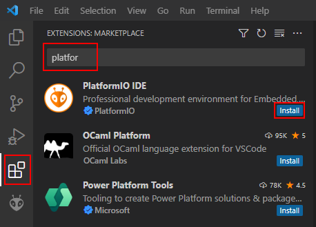
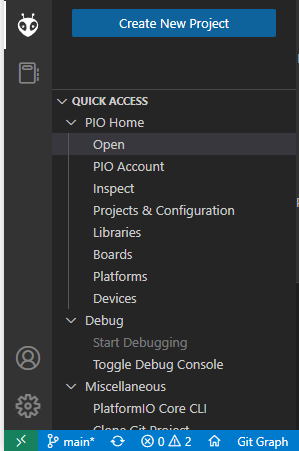
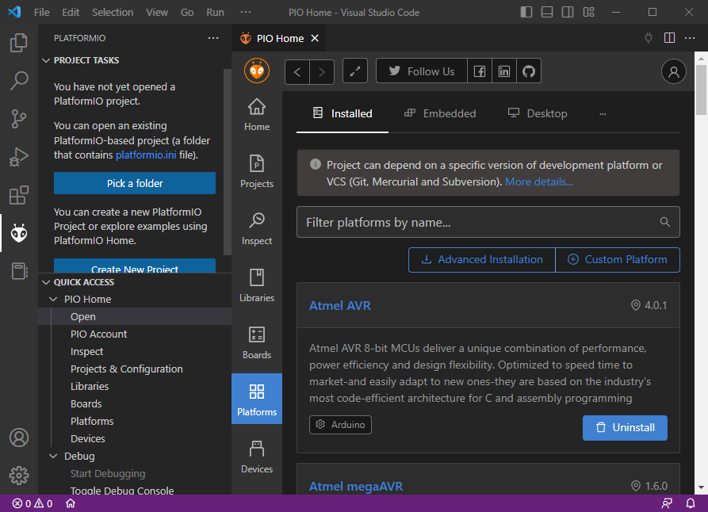
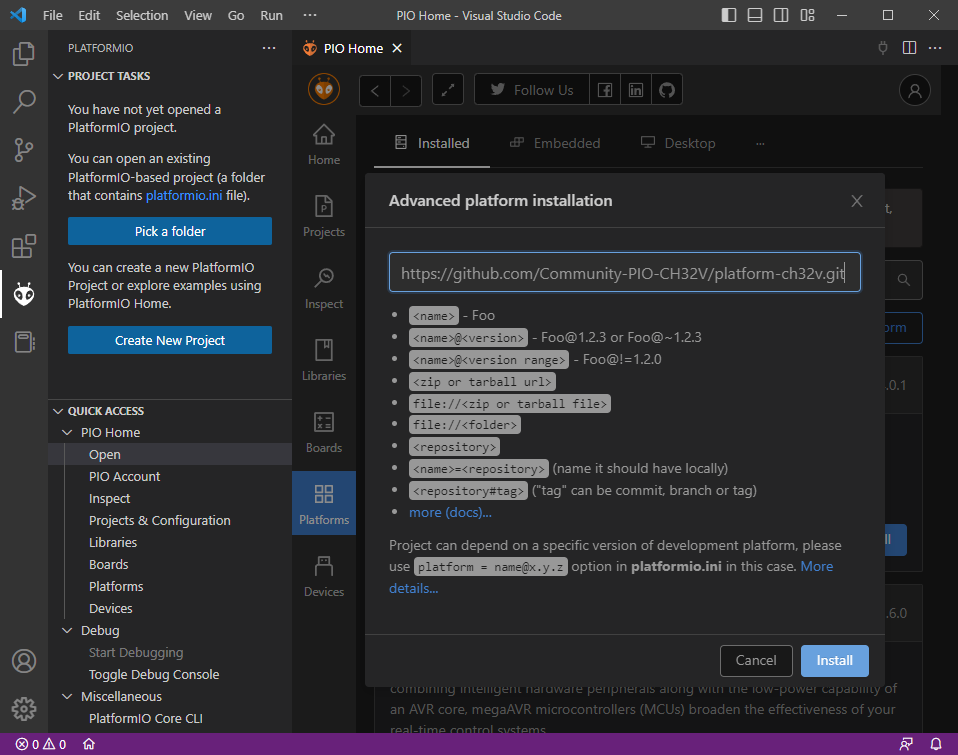
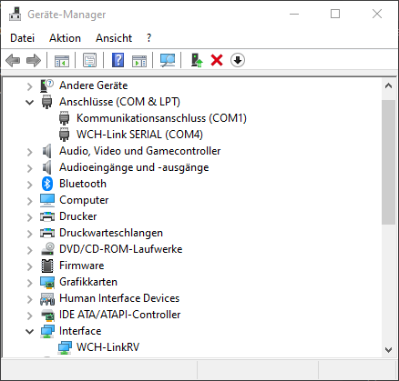
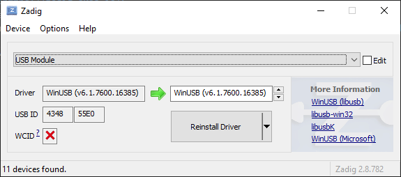

Installation
============

This guide shows how to install the CH32V development environment. Note that this also overlaps with official documentation such as `Getting started with VSCode +
PlatformIO <https://docs.platformio.org/en/latest/integration/ide/vscode.html#installation>`__.

Install VSCode
--------------

Download and install VSCode from https://code.visualstudio.com/.

Install PlatformIO
------------------

Open the "Extensions" sidebar, search for "PlatformIO" and hit "install".

Install CH32V Platform
----------------------

Expand the PlatformIO sidebar (ant icon) and click "PIO Home".

In the resulting PIO Home window, click on the "Platforms" sidebar and
chose “Advanced Installation”

You will be asked for a repistory. Enter the URL and press "Install".

::

   https://github.com/Community-PIO-CH32V/platform-ch32v.git

The platform should now be successfully installed.

Experienced `PlatformIO
CLI <https://docs.platformio.org/en/latest/integration/ide/vscode.html#platformio-core-cli>`__
users can also use the short-hand command

::

   pio pkg install -g -p https://github.com/Community-PIO-CH32V/platform-ch32v.git

Install Drivers / Rules
-----------------------

Windows Driver Installation
~~~~~~~~~~~~~~~~~~~~~~~~~~~

Flashing development boards via a WCH-Link(E) probe (and SWCLK and/or SWDIO connection) requires that W.CH's USB drivers for that are installed.

1. Download the `WCHLink Driver Windows <https://github.com/Community-PIO-CH32V/wchlink-driver-windows/archive/refs/heads/main.zip>`__ package
2. Unpack it
3. Run :code:`WCHLink\\SETUP.EXE` and follow installation instructions
4. Run :code:`WCHLinkSER\\SETUP.EXE` and follow installation instructions

If successful, once you plug in the WCH-Link(E) device, you should have a "serial port" and "interface"-type device in the Windows device manager.

Flashing development boards via their built-in USB bootloader requires that WinUSB drivers are loaded for that device.

1. Download `Zadig <https://zadig.akeo.ie/>`__
2. Start Zadig and activate Options → List All Devices
3. Put your development board into bootloader mode

   * for most: BOOT0 to 3.3V, BOOT1 to GND

   * or hold marked "BOOT" button

4. Plug development board into computer
5. Select the "USB Module" device in Zadig
6. Select "WinUSB" on the right side
7. Click "Replace driver"

It should now look like this:

.. note::
    Some devices like the CH5xx chips seem to have a timeout on the USB bootloader, which complicates things.
    When you hear the USB eject sound, quickly replug the device while holding down the BOOT button of it, then driver
    installation should go through.

Linux udev Rules
~~~~~~~~~~~~~~~~

In Linux, for regular non-sudo users to be able to access certain USB devices, 
like the WCH-Link(E) debugging probe or the USB bootloader device, you need to
set up udev rules. 

First all, make sure PlatformIO's udev rules are installed per `Documentation <https://docs.platformio.org/en/latest/core/installation/udev-rules.html#platformio-udev-rules>`__.

Then, assuming a Debian-like system with a "plugdev" group, append the following content to :code:`/etc/udev/rules.d/99-platformio-udev.rules`:

::

    SUBSYSTEM=="usb", ATTR{idVendor}="1a86", ATTR{idProduct}=="8010", GROUP="plugdev"
    SUBSYSTEM=="usb", ATTR{idVendor}="4348", ATTR{idProduct}=="55e0", GROUP="plugdev"
    SUBSYSTEM=="usb", ATTR{idVendor}="1a86", ATTR{idProduct}=="8012", GROUP="plugdev"

**Restart your system after applying these changes.**

.. note::
    If you are running a different type system, replace the :code:`GROUP` value as needed, e.g., with :code:`uucp`.